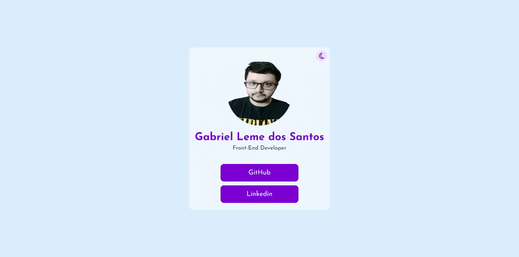

# Light/Dark Mode

## Deploy do projeto

<https://login-register-website-gabriel-l-santos.vercel.app/>

O Light/Dark Mode é um projeto usando HTML, CSS e Javascript, clique no ícone de lua para ativar o Dark Mode, abaixo do meu nome deixei os links dos meus perfis do Linkedin e Github.

## Tabela de Conteúdos

- [Recursos Usados](#recursos-usados)
- [Autor do Projeto](#autor-do-projeto)

## Recursos Usados

- [Font Awesome](https://fontawesome.com/) - (biblioteca de ícones usada para este projeto).

## Autor do Projeto

- GitHub - [Gabriel-L-Santos](https://github.com/Gabriel-L-Santos)
- LinkedIn - [Gabriel Leme dos Santos](https://www.linkedin.com/in/gabriel-leme-dos-santos/)